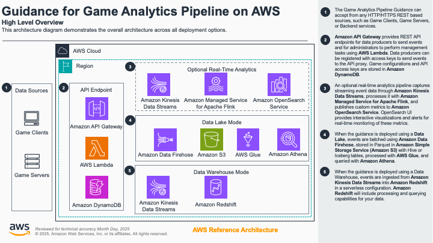

---
hide:
  - navigation
  - toc
---
# Game Analytics Pipeline on AWS

## Overview

The games industry is increasing adoption of the Games-as-a-Service operating model, where games have become more like a service than a product, and recurring revenue is frequently generated through in-app purchases, subscriptions, and other techniques. With this change, it is critical to develop a deeper understanding of how players use the features of games and related services. This understanding allows game developers to continually adapt, and make the necessary changes to keep players engaged.

The Game Analytics Pipeline guidance helps game developers to apply a flexible, and scalable DataOps methodology to their games. Allowing them to continuously integrate, and continuously deploy (CI/CD) a scalable serverless data pipeline for ingesting, storing, and analyzing telemetry data generated from games, and services. The guidance supports streaming ingestion of data, allowing users to gain critical insights from their games, and other applications in near real-time, allowing them to focus on expanding, and improving game experience almost immediately, instead of managing the underlying infrastructure operations. Since the guidance has been codified as a CDK application, game developers can determine the best modules, or components that fit their use case, allowing them to test, and QA the best architecture before deploying into production. This modular system allows for additional AWS capabilities, such as AI/ML models, to be integrated into the architecture in order to further support real-time decision making, and automated LiveOps using AIOps, to further enhance player engagement. Essentially allowing developers to focus on expanding game functionality, rather than managing the underlying infrastructure operations.

