# Available Insights

The Game Analytics Pipeline provides three pre-built insight modules that analyze different aspects of player behavior and game performance. Each module follows a medallion architecture with silver and gold layers, and includes QuickSight visualizations for easy analysis.

## Deployment Order

Due to data dependencies between samples, deploy in this order:

1. **user-activity** (foundational - creates `sessions` table)
2. **store-metrics** (depends on user-activity's `sessions` table)
3. **in-game-analysis** (independent, can be deployed anytime)

Each sample includes complete Terraform configurations for both DATA_LAKE (Glue/Iceberg) and REDSHIFT modes, automatically deploying the appropriate resources based on your pipeline configuration.

## User Activity

This insight module tracks user login and logout activity to determine active user count, recurring users, session length (playtime), and user churn. The design is based on work from [User Acquisition Incrementality for Netflix Games](https://netflixtechblog.com/part-2-a-survey-of-analytics-engineering-work-at-netflix-4f1f53b4ab0f) and [Lifetime Value Part 26: My most valuable retention KPIs by Lloyd Melnick](https://lloydmelnick.com/2019/02/05/lifetime-value-part-26-my-most-valuable-retention-kpis/).

### Source Events

- [Login Event](../references/event-library/user-activity.md#login-event)
- [Logout Event](../references/event-library/user-activity.md#logout-event)

### How it Works

The data processing jobs are scheduled to run at 00:30 UTC (cron(30 0 * * ? *)) and incrementally update the tables with the previous day's metrics.

**Silver Layer Processing:**

The silver layer processes login and logout events to build foundational user activity tables:

1. **User Status Tracking**: Maintains a current state for each user with three possible states:
    - **CURRENT**: Active users who have logged in within the last 7 days
    - **AT-RISK**: Users who haven't logged in for 7+ days (at risk of churning)
    - **DORMANT**: Users who haven't logged in for 28+ days (churned users)

2. **User Status Transitions**: Records when users move between states, enabling churn analysis and re-engagement tracking.

3. **User Counts**: Aggregates daily counts of users in each state to track the health of the playerbase over time.

4. **Session Tracking**: Matches login and logout events by `session_id` to calculate session duration in seconds. This enables playtime analysis and engagement metrics.

5. **User First Join**: Records the timestamp when each user first logged in, providing a foundation for cohort analysis and time-to-monetization calculations.

**Gold Layer Processing:**

The gold layer aggregates silver data for high-level metrics:

- **Daily Session Statistics**: Aggregates session data by date to provide:
  - Total playtime (sum of all session durations)
  - Average playtime per session
  - Session count

**Daily Active Users (DAU) and Monthly Active Users (MAU):**

DAU is calculated from the `user_counts` table by counting users in the CURRENT state for a given day. MAU is calculated by counting all users who logged in within the last 30 days.

### Visualizations

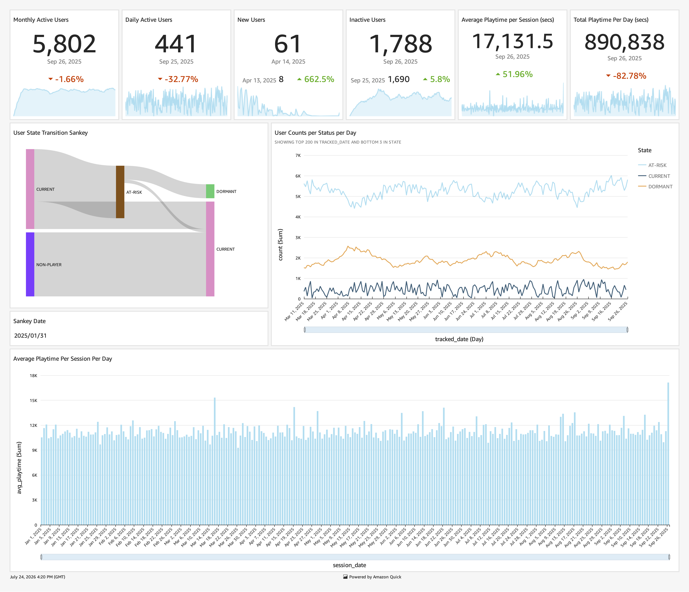

The **Playerbase Overview** QuickSight analysis provides several key visualizations:

**User Status KPIs:**

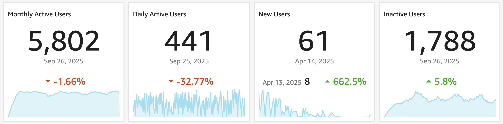

Shows current counts of CURRENT, AT-RISK, and DORMANT users with trend indicators. This gives an at-a-glance view of playerbase health.

**User Status Transitions:**

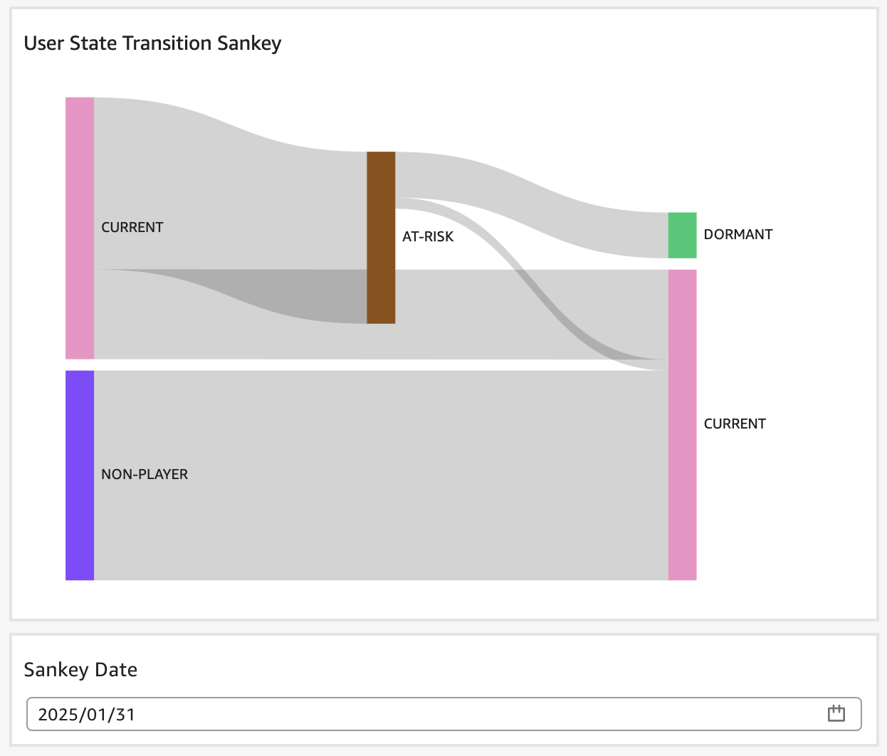{ width="600" }

Displays the flow of users between status states over time. This sankey-style visualization helps identify:

- Churn rates (CURRENT → AT-RISK → DORMANT transitions)
- Re-engagement success (DORMANT/AT-RISK → CURRENT transitions)
- The overall health trajectory of the playerbase

This visualization can be varied per-day to see overall player trends for the specific day

**Daily Session Statistics:**

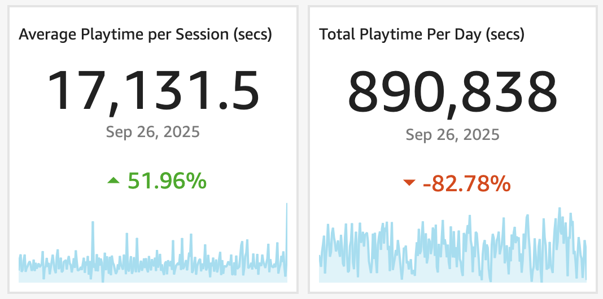{ width="600" }

Line charts showing:

- Total playtime per day
- Average session duration trends

These visualizations help identify engagement patterns, seasonal trends, and the impact of game updates on player behavior.

## Store Metrics

This insight module tracks in-game store performance including revenue, conversion rates, and user lifetime value. It uses virtual currency (tokens) for all monetary values to normalize across currencies and conversion rates.

### Source Events

- [Store Click Event](../references/event-library/monetization.md#store-click-event)
- [Store Purchase Event](../references/event-library/monetization.md#store-purchase-event)

### How it Works

The data processing jobs are scheduled to run at 01:00 UTC (cron(0 1 * * ? *)) and incrementally update the tables with the previous day's metrics.

**Reference Data:**

An `item_prices` fact table is created by the pipeline. This table contains a mapping of in-store item names to their prices in virtual tokens. This table must be populated with your game's item pricing data before running the ETL jobs.

**Silver Layer Processing:**

The silver layer processes store events to build foundational metrics:

1. **Daily Item Store Metrics**: Aggregates store events by item and date:
   - Matches `store_click` events to count item views/clicks
   - Matches `store_purchase` events to calculate:
     - **Quantity**: Total units sold per item
     - **Gross**: Total revenue (quantity × price from item_prices table) in virtual tokens
     - **Transactions**: Number of purchase transactions
   - This enables per-item performance analysis and A/B testing of item placement

2. **Daily User Purchase Metrics**: Tracks purchases at the user-session level:
   - Joins `store_purchase` events with the `sessions` table (from user-activity sample)
   - Calculates gross revenue per session
   - Records the timestamp of first purchase in the session
   - Enables analysis of purchase behavior by session date

3. **User First Join**: Also tracked in this sample (see user-activity above) for LTV calculations

**Gold Layer Processing:**

The gold layer calculates user lifetime value metrics:

- **User LTV (Lifetime Value)**: Aggregates all purchases for each user:
  - **Lifetime Value**: Total revenue from the user across all time
  - **Days to First Monetization**: Time between first login and first purchase
  - **Monetization Date**: Date of first purchase

This enables identification of high-value users, analysis of monetization patterns, and calculation of time-to-revenue metrics.

**Revenue Metrics:**

Standard revenue metrics are calculated from the silver layer:
- Daily gross revenue (sum of gross across all items)
- Revenue per item
- Revenue per transaction

**Conversion Rate Metrics:**

Clickstream conversion is calculated by comparing clicks to purchases:
- View-to-purchase conversion rate per item: `transactions / clicks`
- Identifies items with high interest but low conversion (pricing or UX issues)
- Identifies items with high conversion (optimizing store layout)

### Visualizations

The **Store Metrics** QuickSight analysis provides comprehensive store performance visualizations:

**Transaction Statistics:**

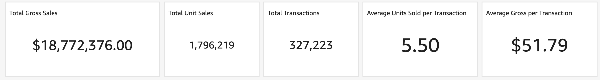

KPI cards showing:
- **Total Gross Sales**: Sum of all revenue in virtual tokens with trend
- **Total Unit Sales**: Total quantity sold with trend
- **Total Transactions**: Count of purchase events with trend
- **Average Units per Transaction**: Average basket size
- **Average Gross per Transaction**: Average transaction value in tokens

**Transactions Per Day:**

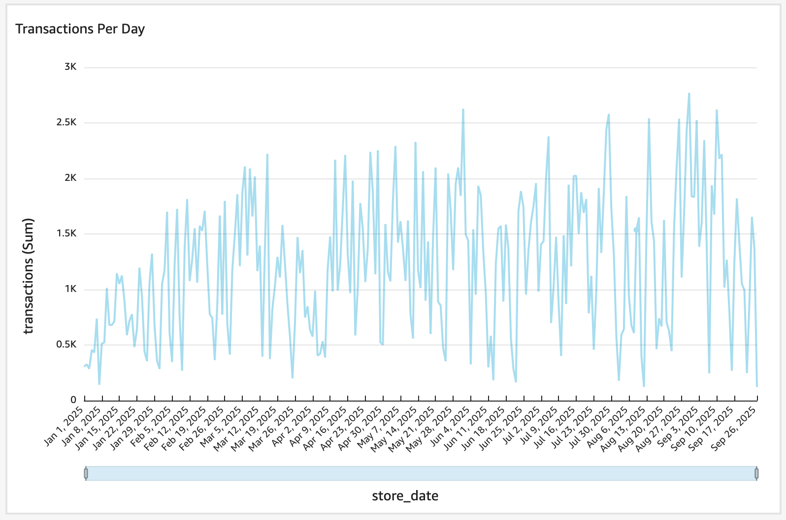{ width="600" }

Line chart showing the trend of transaction volume over time, helping identify:

- Peak purchasing times
- Impact of promotions or updates
- Seasonal patterns

**Gross Per Item:**

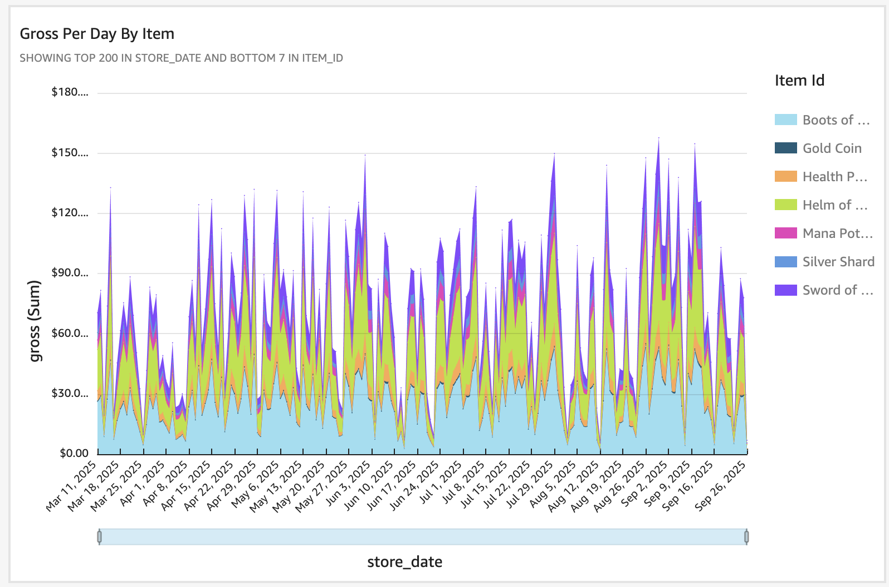{ width="600" }

Bar chart showing revenue broken down by item, enabling:

- Identification of top-performing items
- Analysis of item pricing effectiveness
- Inventory and promotion planning

**Conversion Rate Per Item:**

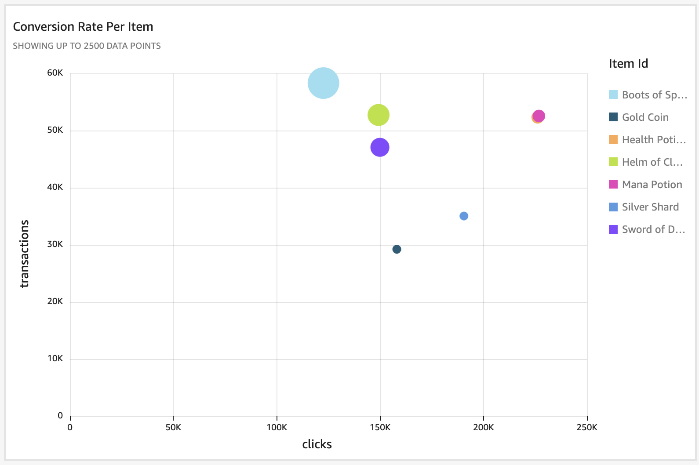{ width="600" }

Bar chart showing the view-to-purchase conversion rate for each store item:

- **Conversion Rate**: Calculated as `transactions / clicks` for each item
- Items sorted by conversion rate to quickly identify top converters

This visualization enables:

- **High conversion items**: Items that sell well when viewed. Consider prominent placement in your store layout or featured sections.
- **Low conversion items**: Items viewed frequently but rarely purchased. Investigate potential issues:
    - Pricing may be too high relative to perceived value
    - Item description or preview may be unclear
    - UX friction in the purchase flow
- **A/B testing opportunities**: Compare conversion rates before and after price changes, description updates, or store layout modifications

**User Lifetime Value (LTV):**

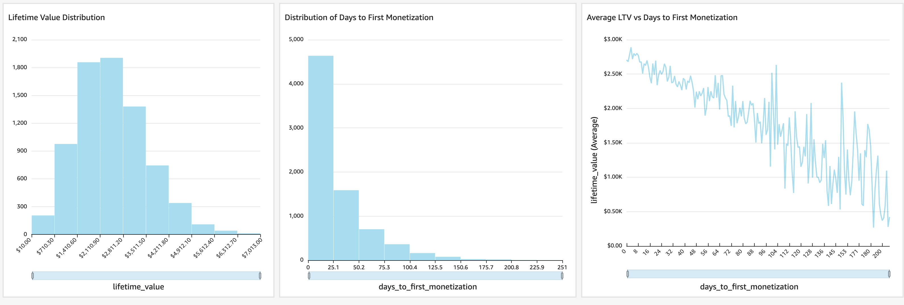

The user lifetime value metrics visualize two key monetization metrics:

- **Days to First Monetization** - The number of days between a user's first login and their first purchase
- **Lifetime Value** - Total revenue generated by the user in virtual tokens

**Key Insights:**

- **Days to First Monetization Distribution**: Shows how quickly users convert to paying customers. A wide spread indicates varied player motivation; a tight cluster suggests a consistent onboarding experience.
- **LTV Distribution**: Visualizes the revenue concentration. A small number of high-LTV users vs. many low-LTV users is common in free-to-play games.
- **Correlation Analysis**: Look for patterns between time-to-monetize and LTV. Identify if early purchasers tend to become high-value users.

**Actionable Metrics:**

From this visualization, you can calculate:

- **Average Days to First Purchase**: Target for optimizing your monetization funnel
- **LTV Percentiles**: Identify your top spenders
- **Monetization Rate**: Compare the count of monetized users to total users from the User Activity sample

## In-Game Analysis

This insight module tracks in-game item actions and trades to understand player behavior, item usage patterns, and the player-driven economy.

### Source Events

- [Item Action Event](../references/event-library/in-game.md#item-action-event)
- [Item Trade Event](../references/event-library/in-game.md#item-trade-event)

### How it Works

The data processing jobs are scheduled to run at 02:00 UTC (cron(0 2 * * ? *)) and incrementally update the tables with the previous day's metrics.

**Silver Layer Processing:**

The silver layer processes item action events to build two analytical tables:

1. **Daily Item Actions**: Aggregates item action events by item, action type, date, and app version:

    - Counts occurrences of each action type (used, crafted, equipped, traded, etc.)
    - Groups by `item_id`, `action`, `event_date`, and `app_version`
    - Enables analysis of:
        - Most used items
        - Crafting patterns
        - Equipment preferences
        - Version-specific behavior changes

2. **Daily Item Trades**: A specialized aggregation of trade events:

    - Filters for `action = 'traded'` events
    - Captures both the traded item (what was given) and received item (what was obtained)
    - Groups by `traded_item`, `received_item`, `event_date`, and `app_version`
    - Enables trade flow analysis and player economy understanding

**Incremental Processing:**

Both tables use incremental processing:

- Each run queries for events newer than the latest `event_date` in the output table
- This ensures no duplicate processing while capturing all new events
- Efficient for daily batch processing of high-volume event streams

### Visualizations

The **In-Game Events Analysis** QuickSight analysis provides item behavior and economy visualizations:

**In-Game Actions Per Item:**

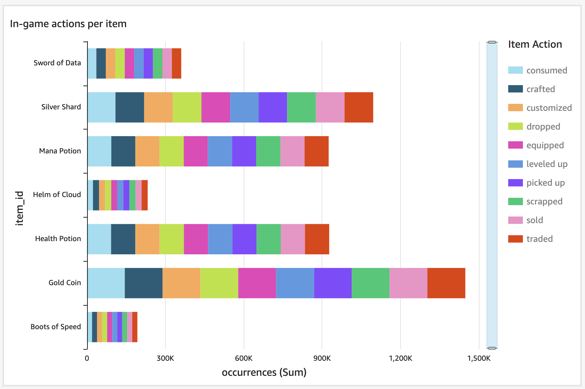{width="600"}

Bar chart showing item actions broken down by:

- Item ID on the x-axis
- Action count on the y-axis
- Color-coded by action type (used, crafted, equipped, etc.)

This visualization helps identify:

- Most popular items in the game
- How items are being used (consumption vs. equipment vs. crafting)
- Items with high usage but low availability (potential bottlenecks)
- Version-specific changes in item usage patterns

**In-Game Trades:**

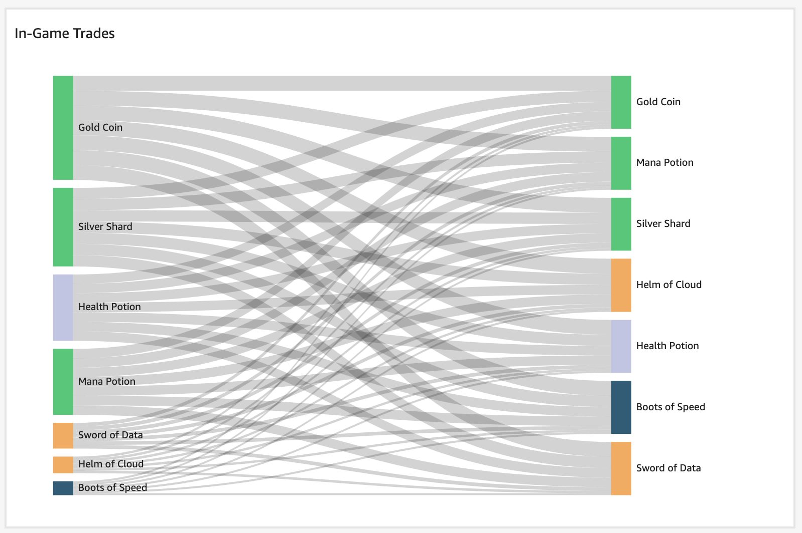{width="600"}

Sankey diagram showing the flow of items through trade:

- Left side: Items being traded away
- Right side: Items being received
- Flow width: Volume of trades

This visualization reveals:

- Popular trade routes and conversion paths
- Item value perception (what players trade for what)
- Imbalances in the player economy
- Opportunities for game balancing adjustments

The sankey diagram is particularly valuable for understanding the player-driven economy and identifying items that serve as de facto currency or are perceived as high-value.
